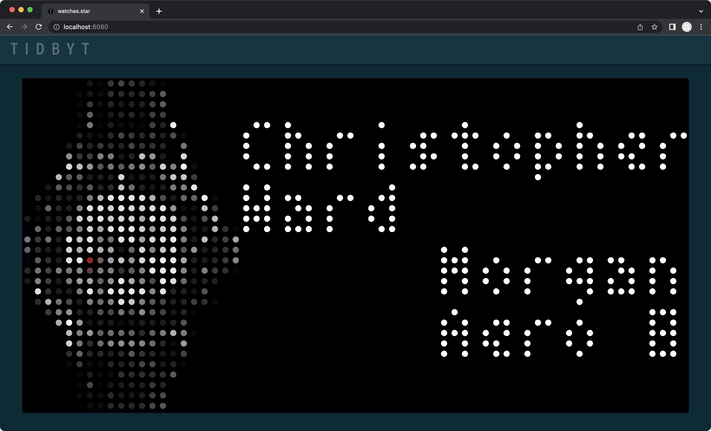
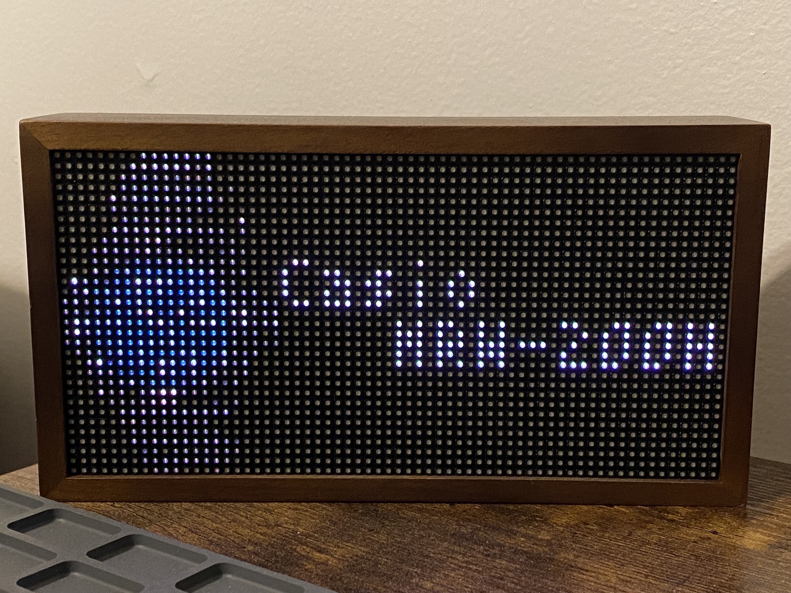

# Tidbyt Collection
<a href="https://tidbyt.com/" target="_blank">Tidbyt</a> Collection is an applet that randomly selects and displays an item from a digitized collection. I use it to select a watch of the day, a suggestion of what to wear.
 

Tidbyt Collection can be repurposed for any type of collection or daily choice. Two different random API call examples are provided.

To change the items displayed, I recommend creating a PNG of each item, use <a href="https://www.pixilart.com/" target="_blank">PIXILART</a> or a similar app to create an image suitable for the 64x32 Tidbyt, convert the PNG to <a href="https://onlinepngtools.com/convert-png-to-base64" target="_blank">base64</a>, and then replace the image data in the .star file. To illustrate applet operation, the `collection.star` file contains an example collection of three watches.

Don't feel like choosing what to wear today or just want to display a random item in your collection every day? Let Tidbyt decide.

Right now the data must be contained in the .star file. Maybe `pixlet` will support external files/libraries at some point, but who knows.